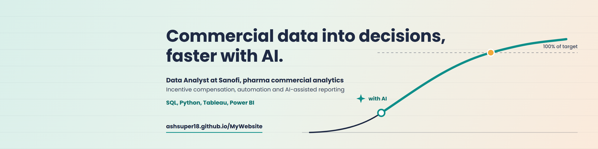

  

  
  
  
  

---

  

<h1 align="center">Hi, I'm Ashish Kumar 👋</h1>
<h3 align="center">Data & Incentive Compensation Analyst | Commercial Analytics & Automation</h3>

  <em>Turning complex commercial data into clear decisions, automated processes, and measurable business outcomes.</em>

  <strong>Data → Automation → Impact</strong>

---

### ⚡ Measurable Value & Impact

| Metric | Outcome & Scope |
| :---: | :--- |
| **⚡ 98%** | **Manual Effort Cut** on selected incentive validation workflows and data pipelines |
| **⏳ 4+ Years** | **Commercial Analytics Experience** spanning pharma operations, sales compensation, and BI |
| **🚀 60%+** | **Faster Report Turnaround** eliminating recurring multi-hour manual cycles via Python & Excel |
| **🎯 99.8%** | **Attainment QC Accuracy** achieved through automated validation and reconciliation frameworks |
| **🌐 Global** | **Pharma Commercial Exposure** collaborating across US and European market stakeholders |

---

### 💼 Professional Experience

- 🏢 **Analyst – Incentive Compensation** @ **[Sanofi](https://www.sanofi.com/)** *(2025 – Present | Hyderabad, India)*
  - Lead incentive compensation analytics, sales crediting, attainment calculations, and automated validation frameworks for commercial teams.
  - Implement Python- and Excel-driven automation, Power BI reporting, and AI-assisted workflow acceleration.
  - Maintain data quality, reconciliation, and exception-handling for commercial operations.

- 🏢 **Data Analyst** @ **[Indegene](https://www.indegene.com/)** *(2022 – 2025 | Bangalore / Hybrid)*
  - Delivered pharma commercial analytics, HCP segmentation, territory alignment, and reporting models.
  - Automated recurring commercial insights using Power BI, SQL, BigQuery, and Python data matching.
  - Partnered cross-functionally with brand and sales operations teams across US/EU markets.

- 🏢 **Finance Analytics Intern** @ **[HighRadius](https://www.highradius.com/)** *(2022 | Hyderabad, India)*
  - Built financial analytics and collections reports using Excel and SQL, supporting data reconciliation.

---

### 🛠️ Skills & Tech Stack

  <strong>📈 Analytics & Scripting:</strong> 
  
  
  
  
  
  
  

  <strong>📊 Business Intelligence & Visualization:</strong> 
  
  
  
  

  <strong>🗄️ Cloud & Enterprise Data:</strong> 
  
  
  

  <strong>💼 Commercial & Domain Focus:</strong> 
  
  
  
  
  

---

### 📂 Featured Portfolio Case Studies

| Project | Focus Area | Description & Outcomes |
| :--- | :---: | :--- |
| [**Incentive Compensation Automation**](https://ashsuper18.github.io/MyWebsite/#projects) | `Incentive Ops` `Automation` | Automated end-to-end sales compensation workflows across targets, attainment, calculation, and reporting. **Cut repetitive manual effort by up to 98%**. *(Python · Excel · Power BI · SQL)* |
| [**Sales & Goal Validation Tool (QC Engine)**](https://ashsuper18.github.io/MyWebsite/#projects) | `QC Framework` `Data Quality` | Built a Python validation engine comparing sales, goals, and territory rosters to flag anomalies and exceptions prior to payout cycles. *(Python · Pandas · Excel)* |
| [**Pharma KPI & Commercial BI**](https://ashsuper18.github.io/MyWebsite/#projects) | `Executive BI` `Reporting` | Integrated multi-brand performance reporting across KPIs, targets, product mixes, and incentive dynamics for commercial decision-makers. *(Power BI · SQL · Excel)* |
| [**HCP Segmentation & Territory Alignment**](https://ashsuper18.github.io/MyWebsite/#projects) | `Commercial Ops` `Field Strategy` | Segmented healthcare providers and structured territory alignment data to provide actionable field targeting context for sales operations. *(Python · Excel · Analytics)* |
| [**Automated Data Matching Engine**](https://ashsuper18.github.io/MyWebsite/#projects) | `Data Engineering` `Fuzzy Matching` | Developed similarity-based and fuzzy reconciliation pipelines to match legacy and disparate commercial datasets with minimal manual review. *(Python · Pandas · Cosine Similarity)* |

👉 *Explore the interactive simulations, playground, and case study modals on my [live portfolio website](https://ashsuper18.github.io/MyWebsite/).*

---

### 📊 GitHub Activity & Stats

  

  
  

---

### 📬 Get In Touch

  
  
  
  

  Open to global analytics, commercial operations, and incentive compensation opportunities.

